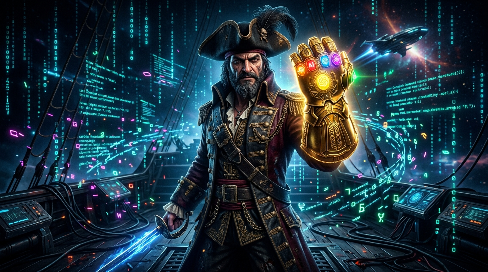

# 🪝 `captain-hook`

> **The Universal Agent Skill & Claude Plugin for Navigating AI Coding Agent Hooks.**



`captain-hook` is an open-source Agent Skill and Claude Plugin that equips AI agents and developers to command, write, scaffold, and configure native lifecycle hooks for **10+ major AI coding agents** (Claude Code, Cursor, Windsurf, Aider, Antigravity, Continue CLI, Roo Code, OpenHands, Copilot, and Amazon Q).

---

## ⛵ Navigating the High Seas of AI Agent Hooks

- **The Pain Point**: Lifecycle hooks are a captain's most powerful weapon for deterministic security guardrails, command sandboxing, and quality gates in AI coding. However, unlike open skill standards, **every AI coding agent uses completely different, constantly changing hook specifications**, configuration schemas, JSON payload shapes, and exit code semantics.
- **The Solution**: `captain-hook` chart-maps all this fragmented information into one unified handbook, scaffolding library, and verification suite—saving developers and AI agents from drifting lost in the open sea of documentation for each individual agent.

---

## ⚓ Boarding the Ship (Installation & Setup)

### 1. Install as a Claude Plugin

Install `captain-hook` directly into Claude Code or compatible AI agent environments:

```bash
/plugin install shmulc8/captain-hook
```

### 2. Manual Clone & Local Verification

```bash
git clone https://github.com/shmulc8/captain-hook.git
cd captain-hook

# Run local hook verification suite before setting sail
./skills/captain-hook/scripts/verify_hooks.sh
```

---

## 🏴‍☠️ What Lies in the Treasure Chest

- 📚 **Handbook & Guide (`SKILL.md`)**: Complete instructions on hook fundamentals, event lifecycles, stdin/stdout JSON contracts, and exit code blocking protocols (`0` ALLOW, `2` BLOCK).
- 🧭 **Exhaustive 10-Agent Specifications (`references/specs/`)**: Self-contained, live-verified specification guides cross-referenced with official documentation.
- 🗡️ **Production Hook Recipes (`references/recipes.md`)**: Copy-pasteable standalone Python, Bash, and Node.js hook scripts for Secret Scanning, Command Sandboxing, Symlink Guards, Auto-Formatting, and Test Gates.
- 📄 **Scaffolding Templates (`examples/`)**: Valid starter configuration files for `.cursor/hooks.json`, `.windsurf/hooks.json`, `.claude/settings.json`, `.aider.conf.yml`, and `hooks/prevent.py`.
- 🛠️ **Local Verification Suite (`scripts/verify_hooks.sh`)**: Test runner script that pipes sample JSON payloads to `stdin` to test your hook scripts locally before deploying.

---

## 🧭 Captain's Navigation Chart (10-Agent Specs)

| AI Coding Agent | Config File Location | Specification Guide |
| :--- | :--- | :--- |
| **Cursor AI** | `.cursor/hooks.json` | [Cursor Hooks Spec](skills/captain-hook/references/specs/cursor.md) |
| **Windsurf (Cascade)** | `.windsurf/hooks.json` | [Windsurf Hooks Spec](skills/captain-hook/references/specs/windsurf.md) |
| **Claude Code** | `.claude/settings.json` | [Claude Code Hooks Spec](skills/captain-hook/references/specs/claude_code.md) |
| **Antigravity (AGY)** | `hooks/prevent.py` | [Antigravity Spec](skills/captain-hook/references/specs/antigravity.md) |
| **Aider AI** | `.aider.conf.yml` | [Aider Hooks Spec](skills/captain-hook/references/specs/aider.md) |
| **Continue CLI (`cn`)** | `~/.continue/settings.json` | [Continue CLI Spec](skills/captain-hook/references/specs/continue.md) |
| **Roo Code / Cline** | `.clinerules` | [Roo Code Spec](skills/captain-hook/references/specs/roo_cline.md) |
| **OpenHands / Devin** | `config.toml` | [OpenHands Spec](skills/captain-hook/references/specs/openhands_devin.md) |
| **GitHub Copilot** | `.github/copilot-instructions.md` | [Copilot Spec](skills/captain-hook/references/specs/copilot.md) |
| **Amazon Q** | `.amazonq/rules` | [Amazon Q Spec](skills/captain-hook/references/specs/amazon_q.md) |

---

## 🗺️ Ship Manifest & Repository Layout

```text
captain-hook/
├── README.md                            # Project overview & hero artwork
├── .claude-plugin/
│   └── plugin.json                      # Claude Plugin manifest
├── assets/
│   └── captain_hook_gauntlet.jpg        # Hero artwork
└── skills/captain-hook/                 # 📚 Agent Skill Handbook & Specifications
    ├── SKILL.md                         # Main skill manual
    ├── scripts/
    │   ├── captain_hook.py              # Standalone reference dispatcher
    │   └── verify_hooks.sh              # Local verification runner
    ├── examples/                        # Starter configuration templates & mock payloads
    │   ├── cursor_hooks.json
    │   ├── windsurf_hooks.json
    │   ├── claude_settings.json
    │   ├── aider_conf.yml
    │   └── payloads/
    └── references/                      # Deep-dive guides & official specs
        ├── matrix.md
        ├── recipes.md
        ├── security_rules.md
        ├── debugging.md
        ├── ci_cd_integration.md
        └── specs/                       # 10 Official Agent Specs
```

---

## 📜 License

MIT License © 2026 shmulc8
