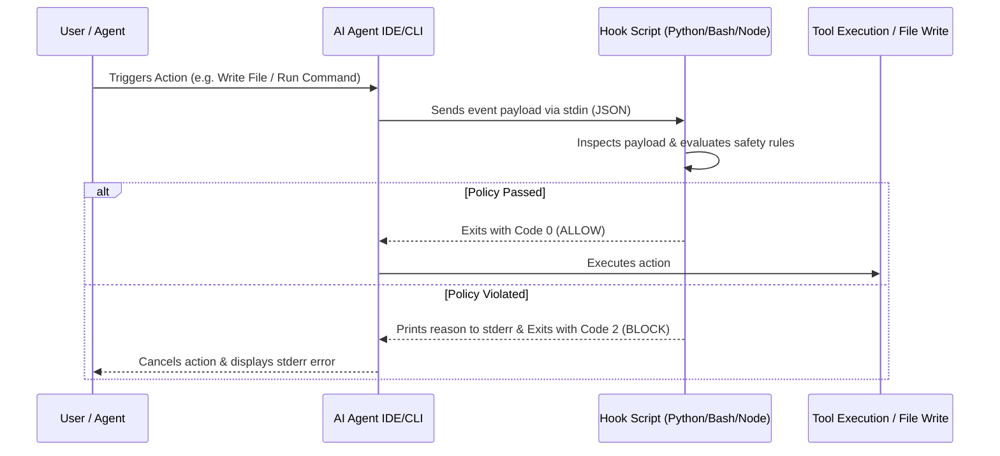

# `captain-hook`: The Handbook for Writing Hooks in AI Coding Agents

This skill teaches you **how to design, write, configure, and troubleshoot lifecycle hooks** for every major AI coding agent.

---

## 1. Fundamentals of AI Agent Hooks

AI coding agent hooks are executable scripts (Bash, Python, Node.js) triggered by the host IDE/CLI at specific lifecycle events (e.g. before submitting a prompt, before executing a command, or after modifying a file).



### The Universal Exit Code Protocol
- **Exit Code `0` (ALLOW)**: The hook approves the operation. Standard output may be logged.
- **Exit Code `1` (RUNTIME ERROR)**: The hook script crashed. Logged to debug console.
- **Exit Code `2` (BLOCK / REJECT)**: The hook explicitly **REJECTS** the operation. Output written to `stderr` is fed back into the AI context or shown to the user.

---

## 2. How to Write Hooks by Agent

### 🎯 A. Cursor AI (`.cursor/hooks.json`)

Cursor reads `.cursor/hooks.json` in your project root or `~/.cursor/hooks.json` globally.

#### Step 1: Create `.cursor/hooks.json`
```json
{
  "version": 1,
  "hooks": {
    "beforeSubmitPrompt": [ { "command": "python3 .cursor/hooks/check_secrets.py" } ],
    "beforeShellExecution": [ { "command": "bash .cursor/hooks/block_danger.sh" } ],
    "afterFileEdit": [ { "command": "npx prettier --write \"$PATH\"" } ]
  }
}
```

#### Step 2: Write the Python Hook Script (`.cursor/hooks/check_secrets.py`)
```python
#!/usr/bin/env python3
import sys, json, re

# Cursor passes payload via stdin
payload = json.load(sys.stdin)
prompt = payload.get("prompt", "")

# Secret detection rule
if re.search(r"\bAKIA[0-9A-Z]{16}\b", prompt):
    sys.stderr.write("Blocked: Prompt contains an AWS Access Key ID!\n")
    sys.exit(2)  # Block execution

sys.exit(0)  # Allow execution
```

---

### 🏄‍♂️ B. Windsurf Cascade (`.windsurf/hooks.json`)

Windsurf loads hooks from `.windsurf/hooks.json` (Workspace), `~/.codeium/windsurf/hooks.json` (User), or `/etc/windsurf/hooks.json` (System).

#### Step 1: Create `.windsurf/hooks.json`
```json
{
  "hooks": {
    "pre_write_code": [ { "command": "python3 .windsurf/hooks/guard_symlinks.py" } ],
    "pre_run_command": [ { "command": "bash .windsurf/hooks/guard_commands.sh" } ],
    "post_write_code": [ { "command": "ruff format" } ]
  }
}
```

#### Step 2: Write the Bash Command Guard (`.windsurf/hooks/guard_commands.sh`)
```bash
#!/usr/bin/env bash
# Read stdin JSON passed by Windsurf
PAYLOAD=$(cat)
# Windsurf passes command string in command_string
CMD=$(echo "$PAYLOAD" | python3 -c "import sys, json; print(json.load(sys.stdin).get('command_string', ''))")

if [[ "$CMD" =~ "rm -rf" ]] || [[ "$CMD" =~ "git push --force" ]]; then
    echo "Blocked: Dangerous command '$CMD' is forbidden by project safety hook!" >&2
    exit 2 # Exit Code 2 explicitly blocks Windsurf Cascade!
fi

exit 0
```

---

### 🤖 C. Claude Code (`.claude/settings.json`)

Claude Code reads `PreToolUse` and `PostToolUse` hooks from `.claude/settings.json`.

#### Step 1: Configure `.claude/settings.json`
```json
{
  "hooks": {
    "PreToolUse": [ { "command": "python3 .claude/hooks/pre_tool_guard.py" } ],
    "PostToolUse": [ { "command": "npm test" } ]
  }
}
```

#### Step 2: Write the PreToolUse Guard (`.claude/hooks/pre_tool_guard.py`)
```python
#!/usr/bin/env python3
import sys, json

payload = json.load(sys.stdin)
tool_name = payload.get("tool_name")
tool_input = payload.get("tool_input", {})

if tool_name == "Bash":
    cmd = tool_input.get("command", "")
    if "sudo" in cmd or "rm -rf" in cmd:
        sys.stderr.write(f"Blocked: Claude Code tool '{tool_name}' attempted forbidden command: {cmd}\n")
        sys.exit(2)

sys.exit(0)
```

---

### ⚡ D. Antigravity AGY (`hooks/prevent.py`)

Antigravity executes `hooks/prevent.py` prior to applying `--fix` or file mutations.

```python
#!/usr/bin/env python3
"""Antigravity write-time prevention hook."""
import sys, subprocess

# Ensure git working tree is clean before allowing auto-fix
res = subprocess.run(["git", "status", "--porcelain"], capture_output=True, text=True)
if res.stdout.strip():
    sys.stderr.write("captain-obvious: uncommitted changes present — commit or stash before running --fix\n")
    sys.exit(2)

sys.exit(0)
```

---

### 🦥 E. Aider AI (`.aider.conf.yml`)

Aider uses `.aider.conf.yml` to set up automated feedback loops.

```yaml
# .aider.conf.yml
auto-lint: true
lint-cmd: "eslint --fix"
auto-test: true
test-cmd: "pytest"
```

---

## 3. Ready-to-Use Hook Recipes

Read the reference guides for full copy-pasteable script implementations:
- [`references/recipes.md`](references/recipes.md) — 5 complete hook scripts (Secret Scanner, Command Sandbox, Symlink Guard, Auto-Formatter, Test Gate).
- [`references/how_to_write_cursor_hooks.md`](references/how_to_write_cursor_hooks.md) — Cursor hook tutorial.
- [`references/how_to_write_windsurf_hooks.md`](references/how_to_write_windsurf_hooks.md) — Windsurf hook tutorial.
- [`references/how_to_write_claude_hooks.md`](references/how_to_write_claude_hooks.md) — Claude Code hook tutorial.

---

## 5. Complete Agent Specification Library (`references/specs/`)

`captain-hook` contains **exhaustive, self-contained specifications** for every major AI coding agent. You can read these files directly without searching the web:

- 🎯 **[Cursor AI Specification](references/specs/cursor.md)** — `.cursor/hooks.json` schema, `stdin` payloads (`filepath`, `prompt`), and event lifecycle.
- 🏄‍♂️ **[Windsurf Cascade Specification](references/specs/windsurf.md)** — `.windsurf/hooks.json` hierarchy, Exit Code 2 cancellation, and `pre_*`/`post_*` events.
- 🤖 **[Claude Code Specification](references/specs/claude_code.md)** — `.claude/settings.json` schema, `PreToolUse`/`PostToolUse`, and native tool payload shapes.
- ⚡ **[Antigravity AGY Specification](references/specs/antigravity.md)** — `hooks/prevent.py` write-time hook and `--check` CI gates.
- 🦥 **[Aider AI Specification](references/specs/aider.md)** — `.aider.conf.yml` schema, `auto-lint`, `lint-cmd`, and closed-loop feedback.
- 🔄 **[Continue CLI Specification](references/specs/continue.md)** — `~/.continue/settings.json` schema and 17 CLI event hooks.
- 🦘 **[Roo Code & Cline Specification](references/specs/roo_cline.md)** — `.clinerules`, `.roomodes`, and custom mode tools.
- 👐 **[OpenHands & Devin Specification](references/specs/openhands_devin.md)** — `config.toml` action interceptors and observation listeners.
- 🐙 **[GitHub Copilot Specification](references/specs/copilot.md)** — `.github/copilot-instructions.md` and pre-commit git hooks.
- 🅰️ **[Amazon Q Specification](references/specs/amazon_q.md)** — `.amazonq/rules` and CLI customization hooks.

---

## 6. Extending `captain-hook` (Modular Architecture)

`captain-hook` features a pluggable Python architecture designed for easy extension:

### Creating a Custom Security Policy
To add a project-specific security guard:

```python
from captain_hook import BasePolicy, HookPayload, PolicyResult, CanonicalEvent

class CustomOrgPolicy(BasePolicy):
    name = "custom_org_policy"
    events_handled = [CanonicalEvent.PRE_PROMPT]

    def evaluate(self, event: str, payload: HookPayload) -> PolicyResult:
        if "INTERNAL_SECRET" in payload.prompt:
            return PolicyResult(allowed=False, exit_code=2, message="Blocked: Internal token leak")
        return PolicyResult(allowed=True, exit_code=0)

# Register with engine
from captain_hook import Engine
engine = Engine()
engine.register_policy(CustomOrgPolicy())
```

### Adding a New Agent Adapter
To support a new AI coding agent:

```python
from captain_hook.adapters import BaseAgentAdapter

class NewAgentAdapter(BaseAgentAdapter):
    name = "new_agent"
    config_relpath = ".newagent/hooks.json"

    def generate_config_content(self) -> dict:
        return {"hooks": {"pre_tool": "captain-hook dispatch PreWrite"}}

engine.register_adapter(NewAgentAdapter())
```
