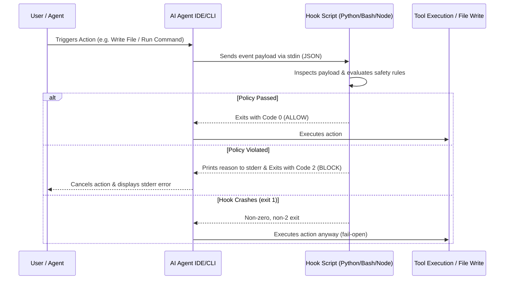

# `captain-hook`: The Agent Skill for Writing Hooks in AI Coding Agents

This skill teaches and assists developers and AI agents in **designing, writing, scaffolding, configuring, and troubleshooting native lifecycle hooks** for every major AI coding agent.

---

## 1. Fundamentals of AI Agent Hooks

AI coding agent hooks are executable scripts (Bash, Python, Node.js) triggered by the host IDE/CLI at specific lifecycle events (e.g. before submitting a prompt, before executing a command, or after modifying a file).



### Exit Codes: What Actually Blocks

There is no single universal protocol. Three rules hold everywhere, and the
rest is per-agent:

- **Exit `0`** — allow. Universally true.
- **Exit `1` and other non-zero codes** — a hook *error*, **not** a block. The
  host logs it and **proceeds with the action**. An unhandled exception in your
  hook script exits `1`, which means your guard fails **open**. Catch your
  exceptions and return `2` deliberately.
- **Exit `2`** — the block signal on Claude Code, Cursor, and Windsurf — but
  only for events that are capable of blocking, and only *before* the action
  runs. Google Antigravity does not use exit codes at all.

| Agent | Exit 2 blocks? | Fail-open on crash? |
| :--- | :--- | :--- |
| **Claude Code** | Only on gate events — `PreToolUse`, `UserPromptSubmit`, `Stop`, `SubagentStop`, `PreCompact` among them | Yes — non-2 codes proceed |
| **Cursor** | Yes, equivalent to `permission: "deny"` | **Yes by default** — set `failClosed: true` per hook to fail closed |
| **Windsurf** | Only on the five `pre_*` hooks | Yes — other codes proceed |
| **Antigravity** | **No** — decide via `{"decision": "deny"}` on stdout | See its spec |

The single most common mistake is assuming a `post_*` hook can block. It cannot:
the action already happened. Post hooks report; they do not gate.

---

## 2. How to Write Hooks by Agent

### 🎯 A. Cursor AI (`.cursor/hooks.json`)

Cursor reads `.cursor/hooks.json` in your project root or `~/.cursor/hooks.json` globally.

#### Step 1: Create `.cursor/hooks.json`
```json
{
  "version": 1,
  "hooks": {
    "beforeSubmitPrompt": [ { "command": "python3 .cursor/hooks/check_secrets.py" } ],
    "beforeShellExecution": [ { "command": "bash .cursor/hooks/block_danger.sh" } ],
    "afterFileEdit": [ { "command": "npx prettier --write \"$PATH\"" } ]
  }
}
```

#### Step 2: Write the Python Hook Script (`.cursor/hooks/check_secrets.py`)
```python
#!/usr/bin/env python3
import sys, json, re

# Cursor passes payload via stdin
payload = json.load(sys.stdin)
prompt = payload.get("prompt", "")

# Secret detection rule
if re.search(r"\bAKIA[0-9A-Z]{16}\b", prompt):
    sys.stderr.write("Blocked: Prompt contains an AWS Access Key ID!\n")
    sys.exit(2)  # Block execution

sys.exit(0)  # Allow execution
```

---

### 🏄‍♂️ B. Windsurf Cascade (`.windsurf/hooks.json`)

Windsurf loads hooks from `.windsurf/hooks.json` (Workspace), `~/.codeium/windsurf/hooks.json` (User), or `/etc/windsurf/hooks.json` (System).

#### Step 1: Create `.windsurf/hooks.json`
```json
{
  "hooks": {
    "pre_write_code": [ { "command": "python3 .windsurf/hooks/guard_symlinks.py" } ],
    "pre_run_command": [ { "command": "bash .windsurf/hooks/guard_commands.sh" } ],
    "post_write_code": [ { "command": "ruff format" } ]
  }
}
```

#### Step 2: Write the Bash Command Guard (`.windsurf/hooks/guard_commands.sh`)
```bash
#!/usr/bin/env bash
# Read stdin JSON passed by Windsurf
PAYLOAD=$(cat)
# Windsurf nests the command under tool_info.command_line
CMD=$(echo "$PAYLOAD" | python3 -c "import sys, json; print(json.load(sys.stdin).get('tool_info', {}).get('command_line', ''))")

if [[ "$CMD" =~ "rm -rf" ]] || [[ "$CMD" =~ "git push --force" ]]; then
    echo "Blocked: Dangerous command '$CMD' is forbidden by project safety hook!" >&2
    exit 2 # Exit Code 2 explicitly blocks Windsurf Cascade!
fi

exit 0
```

---

### 🤖 C. Claude Code (`.claude/settings.json`)

Claude Code reads `PreToolUse` and `PostToolUse` hooks from `.claude/settings.json`.

#### Step 1: Configure `.claude/settings.json`
```json
{
  "hooks": {
    "PreToolUse": [
      {
        "matcher": "Bash|Edit|Write",
        "hooks": [
          { "type": "command", "command": "python3 .claude/hooks/pre_tool_guard.py" }
        ]
      }
    ],
    "PostToolUse": [
      {
        "matcher": "Edit|Write",
        "hooks": [
          { "type": "command", "command": "npm test" }
        ]
      }
    ]
  }
}
```

Each event maps to an array of **matcher groups**, and each group holds a nested `hooks` array. The flat form — an event array whose entries carry `command` directly, with no nested `hooks` array — is **not** valid, and Claude Code will not run it. Omit `matcher` (or use `"*"`) to match every tool.

#### Step 2: Write the PreToolUse Guard (`.claude/hooks/pre_tool_guard.py`)
```python
#!/usr/bin/env python3
import sys, json

payload = json.load(sys.stdin)
tool_name = payload.get("tool_name")
tool_input = payload.get("tool_input", {})

if tool_name == "Bash":
    cmd = tool_input.get("command", "")
    if "sudo" in cmd or "rm -rf" in cmd:
        sys.stderr.write(f"Blocked: Claude Code tool '{tool_name}' attempted forbidden command: {cmd}\n")
        sys.exit(2)

sys.exit(0)
```

---

### ⚡ D. Antigravity (`.agents/hooks.json`)

Antigravity reads `hooks.json` from its customization directory — `.agents/` in the workspace, or `~/.gemini/config/` globally.

Antigravity is the exception to the exit-code pattern used by the agents above — it reads a `decision` field from stdout. A hook that exits `2` blocks nothing here.

#### Step 1: Create `.agents/hooks.json`
```json
{
  "enabled": true,
  "PreToolUse": [
    {
      "matcher": "run_command",
      "hooks": [
        { "type": "command", "command": "python3 .agents/hooks/guard_command.py", "timeout": 30 }
      ]
    }
  ]
}
```

#### Step 2: Write the PreToolUse Guard (`.agents/hooks/guard_command.py`)
```python
#!/usr/bin/env python3
import json, sys

payload = json.load(sys.stdin)
cmd = payload.get("toolCall", {}).get("command", "")

if "--force" in cmd:
    print(json.dumps({"decision": "deny", "reason": "force push is blocked by policy"}))
else:
    print(json.dumps({"decision": "allow"}))
```

---

### 🦥 E. Aider AI (`.aider.conf.yml`)

Aider uses `.aider.conf.yml` to set up automated feedback loops.

```yaml
# .aider.conf.yml
auto-lint: true
lint-cmd: "eslint --fix"
auto-test: true
test-cmd: "pytest"
```

---

## 3. Ready-to-Use Hook Recipes

Read the reference guides for full copy-pasteable script implementations:
- [`references/recipes.md`](references/recipes.md) — 5 complete hook scripts (Secret Scanner, Command Sandbox, Symlink Guard, Auto-Formatter, Test Gate).
- [`references/how_to_write_cursor_hooks.md`](references/how_to_write_cursor_hooks.md) — Cursor hook tutorial.
- [`references/how_to_write_windsurf_hooks.md`](references/how_to_write_windsurf_hooks.md) — Windsurf hook tutorial.
- [`references/how_to_write_claude_hooks.md`](references/how_to_write_claude_hooks.md) — Claude Code hook tutorial.

---

## 5. Verification, Security Catalogs & CI Integration

`captain-hook` includes automated testing and governance tools for production readiness before going public:

- 🧪 **Automated Verification Suite (`scripts/verify_hooks.sh`)**: Runs the bundled reference dispatcher against sample `stdin` payloads and lints the shipped documentation and config templates for schema drift. It verifies *this skill*, not your own hook scripts — to test yours, pipe a fixture from `examples/payloads/` into them directly (see [`references/debugging.md`](references/debugging.md)).
- 📂 **Sample Payloads (`examples/payloads/`)**: Real-world JSON stdin payload files for testing `beforeShellExecution`, `PreToolUse`, and `pre_write_code`.
- 🔒 **[Security & Rule Catalog](references/security_rules.md)** — Production-ready policy patterns (secret scanning, command sandboxing, symlink guard, MCP governance).
- 🛠️ **[Interactive Debugging Guide](references/debugging.md)** — Step-by-step terminal piping and IDE log channel inspection guide.
- 🚀 **[CI/CD Integration Guide](references/ci_cd_integration.md)** — Integrating hook verification into `.git/hooks/pre-commit` and GitHub Actions workflows.
- 📦 **[Invocation & Install Guide](README-INSTALL.md)** — there is no `captain-hook` binary; `<CAPTAIN_HOOK>` in the shipped templates stands for `python3 /abs/path/to/skills/captain-hook/scripts/captain_hook.py`.

---

## 6. Complete Agent Specification Library (`references/specs/`)

`captain-hook` contains **exhaustive, self-contained specifications** for every major AI coding agent:

- 🎯 **[Cursor AI Specification](references/specs/cursor.md)** — `.cursor/hooks.json` schema, `stdin` payloads (`filepath`, `prompt`), and event lifecycle.
- 🏄‍♂️ **[Windsurf Cascade Specification](references/specs/windsurf.md)** — `.windsurf/hooks.json` hierarchy, Exit Code 2 cancellation, and `pre_*`/`post_*` events.
- 🤖 **[Claude Code Specification](references/specs/claude_code.md)** — `.claude/settings.json` schema, `PreToolUse`/`PostToolUse`, and native tool payload shapes.
- ⚡ **[Antigravity Specification](references/specs/antigravity.md)** — `.agents/hooks.json` schema, camelCase payloads, and the stdout `decision` contract (no exit codes).
- 🦥 **[Aider AI Specification](references/specs/aider.md)** — `.aider.conf.yml` schema, `auto-lint`, `lint-cmd`, and closed-loop feedback.
- 🔄 **[Continue CLI Specification](references/specs/continue.md)** — `~/.continue/settings.json` schema and 17 CLI event hooks.
- 🦘 **[Roo Code & Cline Specification](references/specs/roo_cline.md)** — `.clinerules`, `.roomodes`, and custom mode tools.
- 👐 **[OpenHands & Devin Specification](references/specs/openhands_devin.md)** — `config.toml` action interceptors and observation listeners.
- 🐙 **[GitHub Copilot Specification](references/specs/copilot.md)** — `.github/copilot-instructions.md` and pre-commit git hooks.
- 🅰️ **[Amazon Q Specification](references/specs/amazon_q.md)** — `.amazonq/rules` and CLI customization hooks.

---

## 7. Extending the Reference Dispatcher

`scripts/captain_hook.py` is a single ~120-line standalone script with no
dependencies and no plugin system. You extend it by editing it. That is
deliberate: a hook script must start fast and must not fail on a missing import.

### Adding a secret pattern

Append a `(compiled_regex, label)` tuple to `SECRET_PATTERNS`:

```python
SECRET_PATTERNS = [
    # ... existing entries ...
    (re.compile(r"(?i)\backme_tok_[0-9a-f]{32}\b"), "Acme Internal Token"),
]
```

### Adding a blocked command

Append a compiled regex to `BLOCKED_COMMANDS`:

```python
BLOCKED_COMMANDS = [
    # ... existing entries ...
    re.compile(r"\bkubectl\s+delete\s+ns\b"),
]
```

### Adding a whole guard

Guards are sequential blocks inside `dispatch_event()`. Add yours in the same
shape — inspect the extracted fields, write a reason to `stderr`, `return 2`:

```python
    # ... inside dispatch_event(), after the existing guards ...
    # 5. Protected-path guard
    if path and "/infra/prod/" in path:
        sys.stderr.write(f"captain-hook: Blocked: '{path}' is a protected production path\n")
        return 2
```

Order matters: guards run top to bottom and the first `return 2` wins.

### Supporting a new agent

There is no adapter registry. Two things are needed:

1. If the agent's payload uses field names not already handled, add them to the
   relevant `or`-chain in `extract_fields()`. Each chain covers every agent's
   spelling of one concept — do not remove existing entries.
2. Add a config template under `examples/` and a spec under `references/specs/`.

### The extension you cannot make this way

The dispatcher signals allow/deny purely through its exit code. Agents that
decide via a JSON object on `stdout` (Google Antigravity) cannot be blocked by
it at all. Supporting them requires an output-protocol mode, which does not
exist yet.
